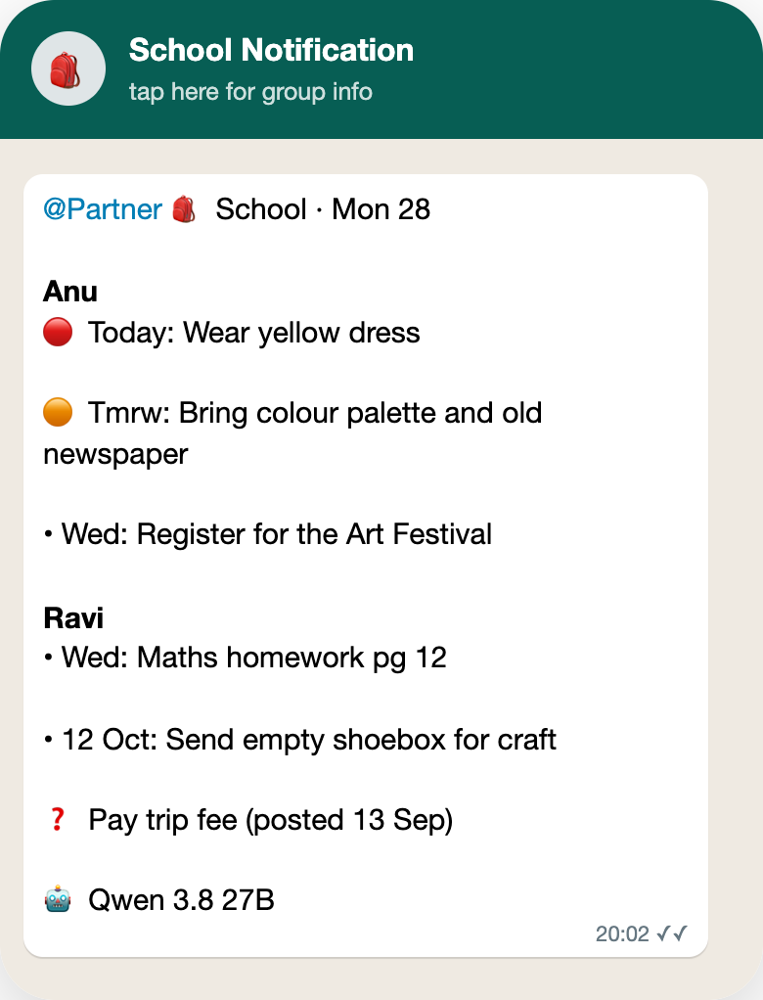

<h1 align="center">🎒 School Reminder Bot</h1>

<p align="center">
  <b>School news arrives by email, Google Classroom, shared Sheets and the teacher's WhatsApp.<br>
  This bot reads all of it and sends one evening reminder of everything that's due.</b>
</p>

<p align="center">
  
</p>

<p align="center">
  
  
  
  
</p>

<p align="center">
  
</p>
<p align="center"><sub>The 8 pm reminder (sample data): 🔴 today · 🟠 tomorrow · • later · ❓ date not stated</sub></p>

## 💡 Why

"Bring a colour palette tomorrow" can hide in an email attachment, a Classroom post, a weekly homework Sheet or a
photo of a notice in the teacher's WhatsApp. Two kids, four channels, every day: something always slips. This bot
gathers it all and turns it into one short list, every evening.

## ⚙️ How it works

<table>
  <tr>
    <td align="center" width="33%"><h3>📥</h3><b>Reads everything new</b><br><sub>School Gmail, Classroom posts with attached Docs/Sheets/PDFs, and the teacher's WhatsApp, photos included</sub></td>
    <td align="center" width="33%"><h3>🧠</h3><b>Finds the tasks</b><br><sub>A local AI model picks out what to do or bring; a date is kept only if the message states it</sub></td>
    <td align="center" width="33%"><h3>💬</h3><b>One WhatsApp at 8 pm</b><br><sub>Everything still due, per child, soonest first; each task repeats daily until its date</sub></td>
  </tr>
</table>

Duplicates are merged, past tasks and one-time codes are dropped, and an edited homework Sheet updates a date instead
of adding a copy. If something fails, the bot WhatsApps you the reason.

## 🚀 Set it up

<table>
  <tr>
    <td align="center" width="33%"><b>1 · Fill in</b><br><sub>Copy <code>.env.example</code> to <code>.env</code>: names, the teacher's chat, the group, a Google OAuth client</sub></td>
    <td align="center" width="33%"><b>2 · Log in once</b><br><sub><code>npm run login</code>: the child's school Google account (read-only), then scan the WhatsApp QR</sub></td>
    <td align="center" width="33%"><b>3 · Switch it on</b><br><sub><code>npm run schedule</code>. To run right now: double-click <code>run-now.command</code></sub></td>
  </tr>
</table>

Needs a Mac with Node 24+, Google Chrome, Xcode command line tools and [LM Studio](https://lmstudio.ai) with Qwen3.8 27B.

## 🔒 Private by design

Google access is read-only. Names, chats and logins stay in `.env` and `data/` on your Mac and are never committed.
The AI runs on the Mac; nothing is sent to the cloud. One-time codes are never forwarded.

<details>
<summary><b>🛠️ For developers</b></summary>

<br>

<p>
  
  
  
  
</p>

- **One run = collect → decide → act.** Collect: Gmail and Classroom since the last run (attachments as text: Docs as
  HTML, Sheets' 3 newest tabs, PDFs/images by OCR), Sheets/Docs seen in the last 14 days re-read when edited, the
  teacher's WhatsApp (one item per day of messages). Decide: one model call per item (JSON schema), then code-side
  rules: grounded dates, confidence, OTP filter, dedupe, max 60 days ahead. Act: the first message per send time
  lists everything still due; later ones only new tasks; sent only when WhatsApp's server confirms.
- **The model** is shared with the other bots through a lease protocol (`kit.js`) and starts loading while WhatsApp
  starts. If it can't be had, the run exits 75 and is retried.
- **WhatsApp** is one linked login shared with pgrs-status-bot (`whatsappDir`: `~/.local/state/whatsapp`).
- **Scheduling:** launchd runs `node kit.js tick` every 5 min (once per slot, 10 min after wake, retries, 10 h limit).

```
bot.js            the run: collect → decide → act
sources.js        Gmail, Classroom, Drive, WhatsApp, text from attachments (OCR, Sheets, HTML)
rules.js          task prompt and schema, date/dedupe rules, what to send, the message (pure, tested)
kit.js            shared kit: config, log, store, model sharing, Google login, WhatsApp, run, scheduler
test.js · kit.test.js       npm test (LIVE=1 also runs the model)
ocr.swift         macOS Vision OCR helper       test-notice.png   OCR test image
config.json       public settings               .env.example      personal values template
pii-check.sh      personal-data gate            run-now.command   double-click = npm start
data/             (gitignored) bot.db · bot.log · run.out · schedule.json · ocr
```

**Commands:** `npm start` · `npm test` · `npm run login [-- google|whatsapp]` · `npm run schedule` / `unschedule`.
**When something fails:** a macOS notification and a WhatsApp to you; details in `data/bot.log` and `data/run.out`.
**License:** MIT.

</details>
